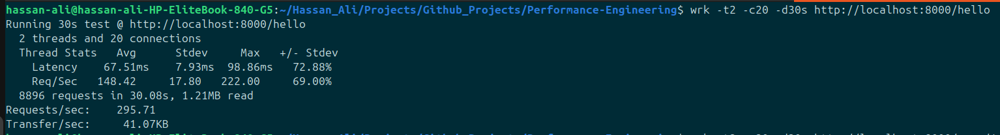
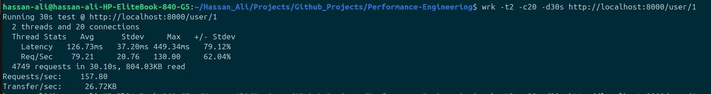
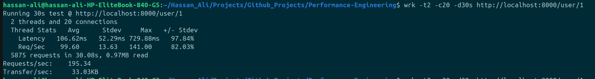
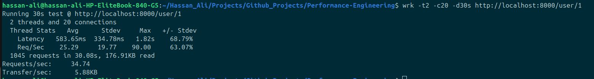

# Python DB Interaction Benchmark (FastAPI)

Continuing from the earlier Python vs Go experiment, this part focuses purely on **Python-based database interaction strategies** and how different approaches affect performance.

The goal here is simple:

> Given the same API and same database, how do different ways of talking to the DB affect performance?

---

## Setup

* Framework: FastAPI
* Database: PostgreSQL (Docker container)
* Benchmarking tool: wrk

### Dataset

* A `users` table with ~1000 records
* Each test reads **user with id = 1** (constant lookup)

---

## Implementations

### 1. Baseline (No DB)

A simple endpoint:

```json
{"hello": "world"}
```

Used to measure:

> Maximum throughput of FastAPI without any DB interaction

---

### 2. Sync DB (psycopg2)

Using:

* psycopg2

Characteristics:

* Blocking I/O
* One query per request
* No async or event loop advantage

---

### 3. Async DB (asyncpg)

Using:

* asyncpg

Characteristics:

* Non-blocking I/O
* Uses async/await
* Connection pooling enabled

---

### 4. ORM (SQLAlchemy Async)

Using:

* SQLAlchemy

Characteristics:

* Abstraction over raw SQL
* Object mapping layer
* Async engine with session management

---

## Benchmarking

All endpoints were tested using:

```bash
wrk -t2 -c20 -d30s --latency http://localhost:8000/<endpoint>
```

Notes:

* Same concurrency and duration across all tests
* Warm-up runs were performed before measurement
* Tests executed locally (localhost)

---

## Results

| Mode     | Requests/sec |
| -------- | ------------ |
| Baseline | 295          |
| Sync DB  | 157          |
| Async DB | 195          |
| ORM      | 34           |

Baseline:


psycopg2:


asyncpg:


sqlalchemy:


---

## Observations

* Baseline shows the upper limit of FastAPI without DB overhead
* Sync DB nearly halves throughput due to blocking behavior
* Async DB improves throughput by handling I/O more efficiently
* ORM introduces a **significant performance drop**, likely due to abstraction overhead

---

## Hypothesis / Why this happens

Some possible reasons:

---

* Sync DB (psycopg2) uses **blocking I/O**, meaning each request waits for the DB query to complete before proceeding. Under concurrency, this limits throughput.

  * psycopg2 docs: https://www.psycopg.org/docs/

---

* Async DB (asyncpg) uses **non-blocking I/O**, allowing the event loop to handle multiple requests while waiting for DB responses. This improves concurrency handling.

  * asyncpg docs: https://magicstack.github.io/asyncpg/current/
  * Python asyncio: https://docs.python.org/3/library/asyncio.html

---

* FastAPI is designed around async execution, so async DB drivers integrate more efficiently with its event loop.

  * FastAPI async docs: https://fastapi.tiangolo.com/async/

---

* ORM (SQLAlchemy) introduces additional overhead due to:

  * Query construction layer
  * Object-relational mapping
  * Session management

  This abstraction improves developer productivity but comes at a runtime cost.

  * SQLAlchemy ORM docs: https://docs.sqlalchemy.org/en/20/orm/

---

* Even though all queries are simple (`SELECT * FROM users WHERE id = 1`), the **overhead of abstraction layers becomes dominant** when the actual DB work is trivial.

---

## Important Notes

* This benchmark (for now) uses a **single repeated query (id = 1)**, which may benefit from caching effects at various layers
* Results may differ under:

  * random queries
  * write-heavy workloads
  * larger datasets

---

## Conclusion

> “Async improved throughput by ~25% over sync in this setup, while ORM reduced throughput significantly due to abstraction overhead — under a simple read-heavy workload.”

---
