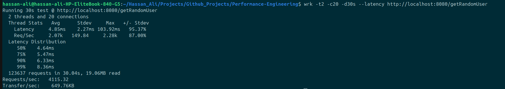
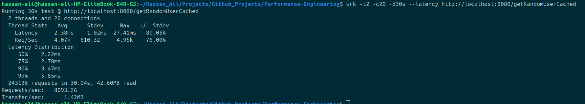
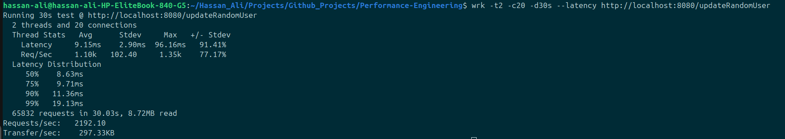
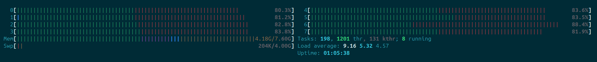
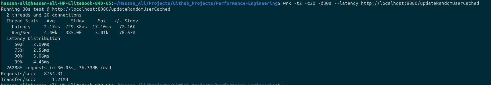
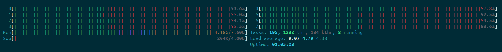

# 🚀 Redis vs Postgres Performance Benchmark (Go)

## 📌 Motivation

The goal of this project was to understand how system throughput changes when moving from direct database interaction to a cache-backed architecture.

During earlier benchmarks (2nd Folder), it became clear that:

- Database reads and writes were **not fully saturating CPU (~80–85%)**
- Yet performance plateaued at relatively low RPS
- Writes in particular showed strong bottlenecking at the database layer

This raised an important question:

> **If the CPU is not fully utilized, what is limiting throughput — and can caching help unlock more performance?**

To investigate this, a Redis caching layer was introduced with:

- Faster in-memory reads/writes
- Reduced database pressure
- Eventual persistence via a flush mechanism (cache → DB)

The hypothesis:

> Redis would increase both read and write throughput while reducing latency, by decoupling application performance from database I/O constraints.

---

## 🏗️ Architecture

### Before (Direct DB)

```
Client → Go API → PostgreSQL
```

### After (Cache + Eventual Consistency)

```
Client → Go API → Redis → (flush endpoint) → PostgreSQL
```

Redis acts as:

- Primary read/write layer (fast path)
- Temporary write buffer
- Staging layer for eventual persistence

---

## ⚙️ Setup

### 1. PostgreSQL (Docker)

```bash
docker run -d \
  --name postgres-db \
  -e POSTGRES_PASSWORD=pass \
  -p 5432:5432 \
  postgres
```

---

### 2. Redis (Docker)

```bash
docker run -d \
  --name redis-cache \
  -p 6379:6379 \
  redis
```

---

### 3. Go Server

```bash
go run main.go
```

Server runs on:

```
http://localhost:8080
```

---

## 📊 Benchmarking Methodology

Tool used:

```bash
wrk -t2 -c20 -d30s http://localhost:8080/hello
```

Where:

- `-t2` → 2 threads
- `-c20` → 20 concurrent connections
- `-d30s` → 30 second duration

Each endpoint was tested under identical load conditions:

- DB read
- DB write
- Cache read
- Cache write

---

## 📈 Results

### 🟡 Database Reads (Postgres)

- **Throughput:** ~2.07k RPS
- **Latency:** ~5 ms



---

### 🟢 Cached Reads (Redis)

- **Throughput:** ~4.07k RPS
- **Latency:** ~2.3 ms

📌 ~2x throughput improvement
📌 ~50% latency reduction



---

### 🔴 Database Writes (Postgres)

- **Throughput:** ~1.1k RPS
- **Latency:** ~9 ms
- **CPU usage:** ~82% across cores

📌 Clear bottleneck under write load
📌 CPU not fully saturated → suggests I/O / contention bound




---

### 🟢 Cached Writes (Redis)

- **Throughput:** ~4.4k RPS
- **Latency:** ~2.17 ms
- **CPU usage:** ~93% across cores

📌 ~4x throughput improvement
📌 Significant latency reduction
📌 System much closer to CPU saturation




---

## 🧠 Observations

### 1. Database is the write bottleneck

Even though CPU was not fully saturated (~82%), writes were limited due to:

- disk I/O overhead
- transaction commit cost
- WAL logging
- row-level locking
- connection overhead

---

### 2. Redis removes most latency overhead

Redis improves performance due to:

- in-memory operations (no disk)
- event-loop based architecture
- no transactional commit overhead
- minimal serialization cost

---

### 3. CPU utilization increases with cache usage

Redis write path pushes system closer to saturation (~93%) because:

- work shifts from I/O wait → CPU processing
- fewer blocking operations
- higher throughput per request

---

### 4. Write amplification in DB is significantly higher

Each DB write triggers:

- WAL log write
- index update
- potential lock contention
- disk flush behavior

Redis avoids all of this in the fast path.

---
