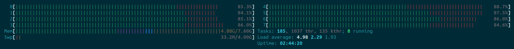
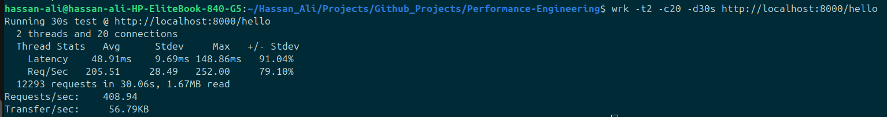
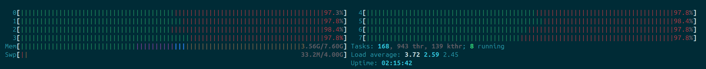
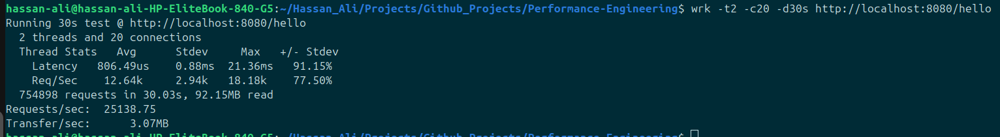

# Python vs Go

In this folder, I will be trying to get a difference in performance of applications based on their languages. This is inspired from when I was asked in an interview:

> "Ok, so you think go is better than python? why?"

…and a fresh grad me who had his mid semester exams coming up had no real idea of numbers and reasons, just a phrase he had found on a few medium articles he read.

This folder is the first attempt and an intention to look for an answer to that question — **quantitatively, the actual way.**

---

## Setups:

### DB setup:

In all comparisons, a PostgreSQL container is used.

#### Run Postgres:

```bash
docker run --name pg-bench \
  -e POSTGRES_PASSWORD=pass \
  -p 5432:5432 \
  -d postgres:alpine
```

#### Enter psql:

```bash
docker exec -it pg-bench psql -U postgres
```

#### Create table:

```sql
CREATE TABLE users (
    id SERIAL PRIMARY KEY,
    name TEXT,
    email TEXT
);
```

#### Insert dummy data:

```sql
INSERT INTO users (name, email)
SELECT 'user' || i, 'user' || i || '@test.com'
FROM generate_series(1, 1000) i;
```

#### Verify:

```sql
SELECT COUNT(*) FROM users;
```

---

### Python setup:

A simple FastAPI application with:

* A hello world endpoint
* A db read endpoint
* A db write endpoint

This framework is chosen because from what I have seen, python is argued to have better dev experience and faster development, over its performance tradeoffs. A majority of companies use python along with FastAPI, so this is done to keep my performance comparison consistent with what **"is" (python + FastAPI)** vs what **"could be" (go + native packages).**

---

### Go Setup:

A simple go application using native `net/http` package (to avoid framework overhead) and pgx for database queries.

It also has:

* A hello world endpoint
* A db read endpoint
* A db write endpoint

---

## Benchmarking

Load testing is done using wrk.

Example:

```bash
wrk -t2 -c20 -d30s http://localhost:8000/hello
```

---

## Results:

### Hello World Endpoint

#### Python Averages (FastAPI, 8 workers) 

* ~205 requests/sec
* ~48 ms latency

Cpu Utilization:


Benchmark Results:



#### Go Averages (net/http, GOMAXPROCS=8)

* ~13.5k requests/sec
* ~0.7 ms latency

Cpu Utilization:


Benchmark Results:


---


## Observations (initial)

* Go massively outperforms Python in raw throughput (~65x in this setup)
* Go fully utilizes CPU cores, while Python appears to be limited
* Latency in Python is significantly higher even for trivial workloads

---
## Hypothesis / Why this happens

Some possible reasons:

* Python is limited by the **Global Interpreter Lock (GIL)**, meaning only one thread executes Python bytecode at a time within a process. This simplifies memory management but restricts true parallel CPU execution in multi-threaded programs.  
  - Official Python docs on GIL: https://docs.python.org/3/c-api/init.html#thread-state-and-the-global-interpreter-lock  
  - Good explanation (why it exists): https://www.geeksforgeeks.org/python/what-is-the-python-global-interpreter-lock-gil/

---

* Go uses **goroutines** and a runtime scheduler that maps them onto OS threads, allowing it to utilize multiple CPU cores in parallel by default. This enables true concurrent execution for CPU-bound and IO-bound workloads.  
  - Go scheduler + goroutines: https://go.dev/doc/effective_go#goroutines  
  - GOMAXPROCS (controls parallelism): https://pkg.go.dev/runtime#GOMAXPROCS

---

* FastAPI runs on top of an **ASGI server (uvicorn)**, which introduces additional abstraction layers such as:
  - ASGI interface handling  
  - event loop scheduling  
  - request parsing and routing  

  These layers improve flexibility and developer experience but add runtime overhead compared to lower-level implementations.  
  - FastAPI async docs: https://fastapi.tiangolo.com/async/  
  - Uvicorn documentation: https://www.uvicorn.org/

---

* Go’s `net/http` package is **closer to the metal and part of the standard library**, meaning:
  - fewer abstraction layers  
  - highly optimized request handling  
  - tight integration with Go’s runtime and scheduler  

  This results in lower latency and higher throughput under load.  
  - Go net/http docs: https://pkg.go.dev/net/http

---

* Serialization and request handling in Go is faster due to:
  - **static typing** (no runtime type resolution)  
  - **compiled binaries** (no interpreter overhead)  
  - more efficient memory layout and allocation patterns  

  In contrast, Python performs more work at runtime due to its dynamic nature.  
  - Go JSON package: https://pkg.go.dev/encoding/json  
  - Python JSON docs: https://docs.python.org/3/library/json.html

---

* Python async (used by FastAPI) is based on an **event loop (cooperative multitasking)**, meaning tasks yield control manually (`await`). While efficient for IO-bound workloads, it does not provide parallel CPU execution within a single process.  
  - Python asyncio docs: https://docs.python.org/3/library/asyncio.html

---

* Go uses **preemptive scheduling**, meaning goroutines can be interrupted and rescheduled by the runtime automatically. This leads to better CPU utilization under heavy concurrent workloads compared to cooperative async models.  
  - Go scheduler deep dive: https://go.dev/blog/scheduler

---

> **Conclusion:**  
> These differences become most visible in CPU-bound and high-concurrency scenarios, which is why even a simple “hello world” benchmark shows significant divergence.

---
